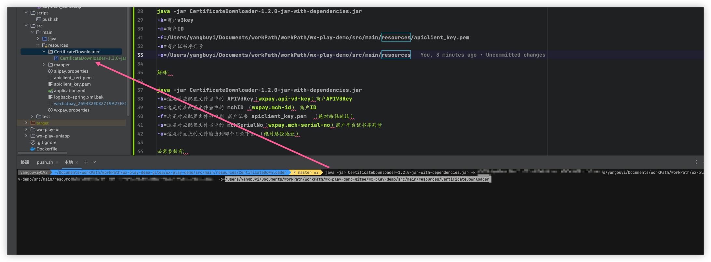
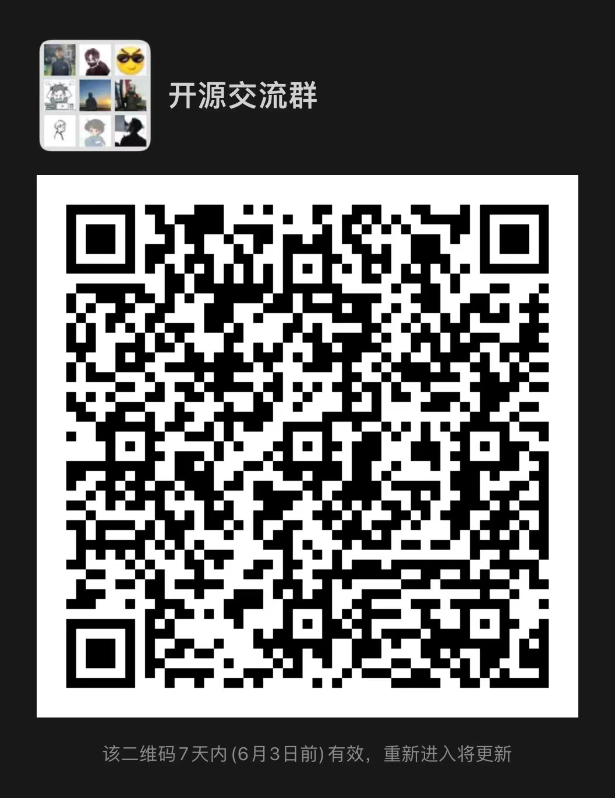
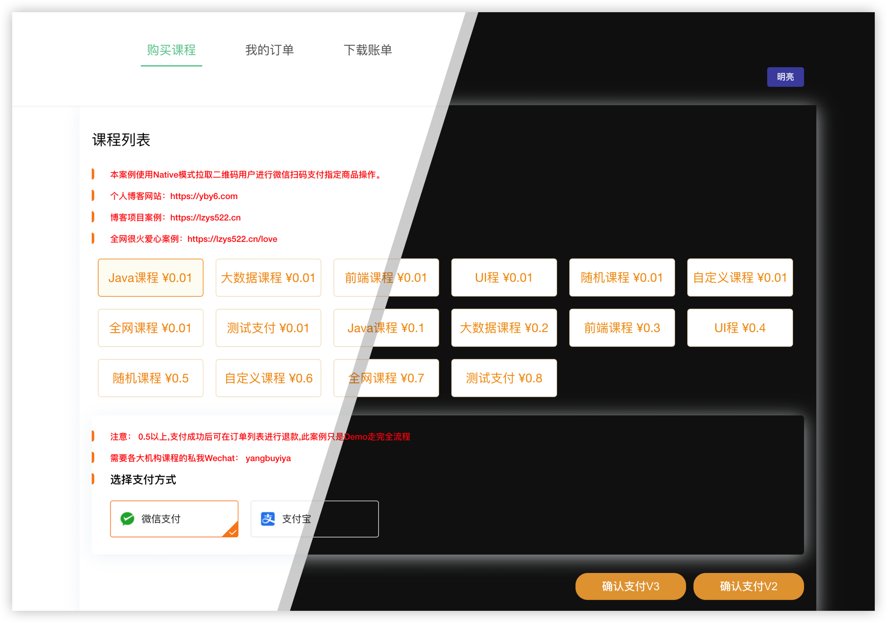
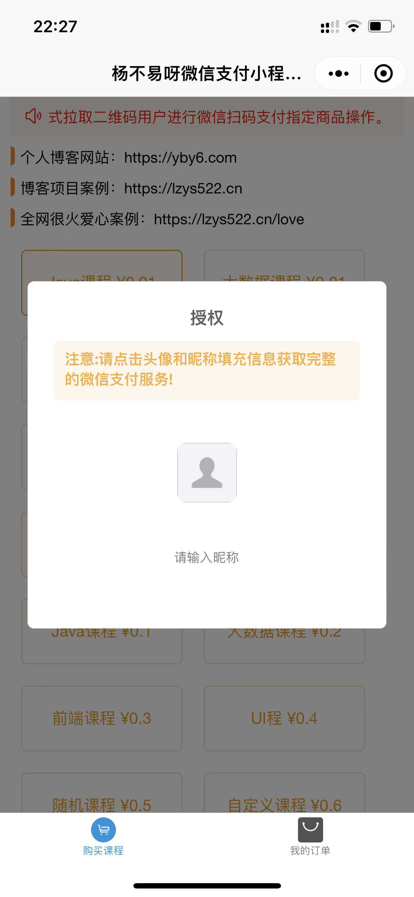
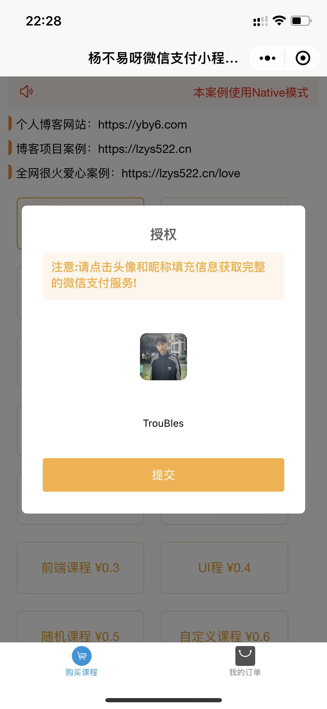
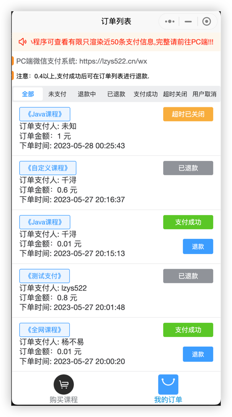

# 从零玩转微信支付

### 介绍
使用微信官方文档对接微信支付
内置使用IJPay-AliPay对接支付宝懒得自己搞了

###  软件架构
<p> 前端 vue3 + vite + element plus
<p> 小程序 uniapp
<p> 后端 boot 2.x + mybatis plus + mysql

###  安装教程
1. 将商户证书全部复制到**resources**目录下
2. 下载微信平台证书（不是商户证书）

#### 2.1 Certificate Downloader
Certificate Downloader 是 Java 微信支付 APIv3 平台证书的命令行下载工具。
#### 前置条件
+ JRE 1.8+
#### 快速开始
该工具已经通过 Maven 打包成 CertificateDownloader.jar，可在 [release ](https://github.com/EliasZzz/CertificateDownloader/releases) 中下载。
下载 jar 包后，如果你没有证书，第一次下载证书的命令如下

```bash
java -jar CertificateDownloader.jar -k ${apiV3key} -m ${mchId} -f ${mchPrivateKeyFilePath} -s ${mchSerialNo} -o ${outputFilePath}

示例：

java -jar CertificateDownloader-1.2.0-jar-with-dependencies.jar 
-k=商户v3key 
-m=商户ID 
-f=/Users/yangbuyi/Documents/workPath/workPath/wx-play-demo/src/main/resources/apiclient_key.pem 
-s=商户证书序列号 
-o=/Users/yangbuyi/Documents/workPath/workPath/wx-play-demo/src/main/resources

解释：

java -jar CertificateDownloader-1.2.0-jar-with-dependencies.jar 
-k=这是对应配置文件当中的 APIV3Key（wxpay.api-v3-key）商户APIV3Key
-m=这是对应配置文件当中的 mchID （wxpay.mch-id） 商户ID 
-f=这是对应配置文件当中到 商户证书 apiclient_key.pem  （绝对路径地址）
-s=这是对应配置文件当中的 mchSerialNo（wxpay.mch-serial-no）商户平台证书序列号
-o=这是将生成的文件输出到哪个目录下面 （绝对路径地址）

必需参数有：

- `-f <privateKeyFilePath>`，商户API私钥文件路径
- `-k <apiV3Key>`，证书解密的密钥
- `-m <merchantId>`，商户号
- `-o <outputFilePath>`，保存证书的路径
- `-s <merchantSerialNo>`，商户API证书的序列号
```




### 后端配置
<p> 1.1 前往 wxpay.properties 配置好对应的微信配置</p>
<p> 1.2 前往 application.yml 配置好数据库链接信息

### pc端配置
<p> 1. vite.config.js 配置你的后端请求url

### uniapp小程序配置
<p> 1.1 使用 HBuilder软件导入wx-play-uniapp
<p> 1.2 修改后端对应到appId 
<p> 1.3 修改wx-play-uniapp/utils/request.js 请求路径 baseUrl

### 本地支付回调调试
1. 使用内网穿透工具代理后端端口
2. 前段修改对应的baseUrl


# 微信群聊
微信搜索 `BN_Tang` 加好友备注微信支付邀请入群解答



# PC端演示
[前往](https://lzys522.cn/wx/)


# uniapp小程序演示







